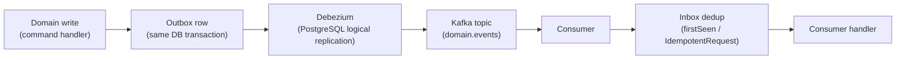

# Architecture Overview

This page condenses the system design. The [Architecture Decision Records](../adr/ADR-001-repository-strategy.md)
are the technical authority; this page is a guided tour through them.

## Architecture modes (ADR-004)

Every microservice explicitly declares one of three modes in its own `README.md`. There is no
default that applies everywhere, and no mixing modes without tech-lead approval:

| Mode | When | Used by |
| --- | --- | --- |
| **Simple Service Layer** | Straightforward CRUD, one or two aggregates | notification-service |
| **CQRS + Mediator** | The default for real domain logic | identity, customer, product-catalog, subscription, usage, ticket, campaign, fraud |
| **Domain Orchestration** | Multi-aggregate sagas coordinating other services | order, billing, payment, dispute |

This prevents both over-engineering a simple service and under-structuring a genuinely complex
one. See [ADR-004](../adr/ADR-004-architecture-style.md) and the full
[Service Catalog](../architecture/service-catalog.md).

## Platform layering (ADR-007, ADR-018, ADR-020)

```text
platform-bom  -->  platform-core/*  -->  platform-starters/*  -->  microservices
```

- **`platform-bom`** pins every dependency version centrally; no service pom hardcodes a version.
- **`platform-core/*`** (`common`, `cqrs`, `mediator`, `outbox`, `inbox`, `lock`) is
  framework-agnostic - no Spring dependency at all - and carries no business logic.
- **`platform-starters/*`** (`starter-api`, `starter-mediator`, `starter-security`,
  `starter-outbox`, `starter-inbox`, `starter-observability`, `starter-lock`, `starter-kafka`,
  `starter-log-persistence`) wrap the core modules with Spring Boot auto-configuration.
- **Microservices depend only on starters, never on `platform-core` directly** (the one narrow,
  explicitly-scoped exception is `platform-event-contracts`, per the ADR-018 amendment, since it
  is schema-only with no runtime behavior).

This is enforced structurally, not just by convention - a service whose dependency tree contains
`platform-core` is a build-time red flag. See
[Platform & Reuse-Before-Build](platform-and-reuse.md) for what you get from each starter.

## CQRS + Mediator (ADR-008)

A custom-built (not third-party) mediator framework under `platform/platform-core/mediator` and
`platform/platform-core/cqrs`, with a pluggable behavior pipeline:

```text
Controller -> Mediator.send(command) / .query(query)
                 |
      Validation -> Authorization -> Logging -> Transaction -> Performance -> Inbox (if applicable)
                 |
              Handler (one per command/query/event, stateless)
```

Rules that matter day to day: commands are immutable and never return domain entities directly;
queries never mutate state; handlers never call each other directly or publish to Kafka
directly - they call `OutboxService.publish(...)` instead, so the domain write and the outbox row
land in the same transaction.

## Event-driven backbone (ADR-005, ADR-009, ADR-019)



- No service calls the Kafka producer/consumer API directly - the outbox/inbox abstraction is
  mandatory (ADR-005).
- Every event is versioned `domain.event.v1`, Avro-encoded, and registered in the Schema Registry
  before it can reach production (ADR-019). A breaking change requires a new version; old
  versions stay supported until every consumer migrates.
- Debezium routes on the outbox table's `aggregate_type` column - it must be the lowercase domain
  name (e.g. `subscription`) or the row is silently never delivered to the topic a consumer
  expects.
- Consumers must be idempotent: the inbox pattern collapses redeliveries of the same message to a
  single effect.

Full registry and the two documented saga sequences: [Events & Messaging](events-and-messaging.md)
and the authoritative [Event Catalog](../architecture/event-catalog.md).

## Service communication (ADR-005)

- **External clients** (browser, Postman, partners) talk to the platform over REST through the
  API Gateway only. `/internal/**` endpoints are denied at the edge.
- **Internal synchronous calls** use REST/OpenFeign with Resilience4j circuit breakers (gRPC was
  evaluated and deferred post-MVP).
- **Internal asynchronous calls** are Kafka, always via the outbox/inbox pair above.

## Database strategy (ADR-006)

Database-per-service, PostgreSQL 17 as the default primary store; MongoDB is an explicitly
approved exception (notification-service today, product-catalog-service planned as a read-side
projection) and is never used for financial/order/billing data. No service reaches another
service's schema directly - every cross-service read goes through that service's API or an event.
Binary artifacts (KYC documents, invoice PDFs, dispute evidence) live in MinIO, referenced by
object key, never stored as DB blobs.

## Security boundary

```text
Browser --Authorization Code + PKCE--> Keycloak --JWT--> API Gateway --validate (JWKS)--> services
```

The gateway is the single validated trust boundary; it strips any client-supplied identity
headers and re-injects `X-User-Id` / `X-User-Roles` from the verified token before forwarding
downstream. Full detail: [Security & Identity](security-and-identity.md).

## Where this is going

Sprints 17-23 (documented in [Roadmap & Status](roadmap-and-status.md)) extend this baseline with
distributed locking (Redisson), centralized secrets (Vault), a service mesh with mTLS (Linkerd),
chaos engineering, and three new domain services: campaign validation, invoice disputes, and
rule-based fraud detection.
